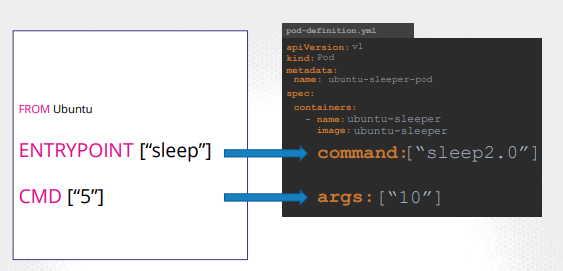

# CKA/CKAD certification documentation

## Core concepts

### Architecture


- Kube API Server
    - API servers acts as the front-end
- ETCD
    - Distributed key-store to persist data used to manage cluster
- Scheduler
    - Responsible for distributing work or containers across nodes
- Controller
    - Brain behind orchestration
- Container runtime
    - Uderlyong software to run containers
- Kubelet
    - Agent running on each node
- Kube-proxy
    - Component in charge of networking within Kubernetes

### Yaml

https://yaml.org/spec/1.2.2/

### Kubectl

Imperative vs Declarative

```yaml
kubectl create pod
kubectl create -f pod.yaml
```

### Commands and arguments

> A container only lives as long as the process inside it is alive. If the web service inside the container is stopped or crashes the container exits.

```shell
CMD command param => CM sleep 5
CMD["command","param"] => CM["sleep","5"]
```

> The entrypoint
instruction is like the command instruction, as in you can specify the program that will be run when the container starts.

In case of the CMD instruction the command line parameters passed will get replaced entirely, whereas in case of entrypoint the command line parameters will get appended.



The command overrides the entrypoint instruction and the args field 
overrides the command instruction in the Dockerfile. Remember the command field does not override the CMD instruction in the Dockerfile

https://kubernetes.io/docs/tasks/inject-data-application/define-command-argument-container/

### K8S primitives

#### Pod

```yaml
apiVersion: v1
kind: Pod
metadata:
  name: hello
spec:
  containers:
  - name: hello
    image: busybox:1.28
    command: ['sh', '-c', 'echo "Hello, Kubernetes!" && sleep 3600']
```

#### ReplicaSet

```yaml
apiVersion: apps/v1
kind: ReplicaSet
metadata:
  name: frontend
  labels:
    app: guestbook
    tier: frontend
spec:
  replicas: 3
  selector:
    matchLabels:
      tier: frontend
  template:
    metadata:
      labels:
        tier: frontend
    spec:
      containers:
      - name: php-redis
        image: gcr.io/google_samples/gb-frontend:v3
```

#### Deployment

```yaml
apiVersion: apps/v1
kind: Deployment
metadata:
  name: nginx-deployment
  labels:
    app: nginx
spec:
  replicas: 3
  selector:
    matchLabels:
      app: nginx
  template:
    metadata:
      labels:
        app: nginx
    spec:
      containers:
      - name: nginx
        image: nginx:1.14.2
        ports:
        - containerPort: 80
```

#### Namespace

In Kubernetes, namespaces provides a mechanism for isolating groups of resources within a single cluster. Names of resources need to be unique within a namespace, but not across namespaces. Namespace-based scoping is applicable only for namespaced objects (e.g. Deployments, Services, etc) and not for cluster-wide objects (e.g. StorageClass, Nodes, PersistentVolumes, etc).

Namespaces are a way to divide cluster resources between multiple users.

Namespaces are intended for use in environments with many users spread across multiple teams, or projects.

It is not necessary to use multiple namespaces to separate slightly different resources, such as different versions of the same software: use labels to distinguish resources within the same namespace.