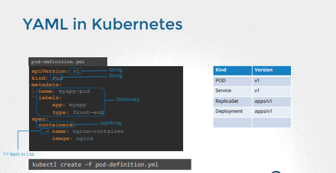

# CKA/CKAD certification documentation

## Core concepts

### Architecture


- Kube API Server
    - API servers acts as the front-end
- ETCD
    - Distributed key-store to persist data used to manage cluster
- Scheduler
    - Responsible for distributing work or containers across nodes
- Controller
    - Brain behind orchestration
- Container runtime
    - Uderlying software to run containers
- Kubelet
    - Agent running on each node of the cluster
- Kube-proxy
    - Component in charge of networking within Kubernetes

### Container runtime

||ctr|nerdctl|crictl|
|---|---|---|---|
|Purpose|Debugging|General purpose|Debugging|
|Community|ContainerD|ContainerD|Kubernetes|
|Works with|ContainerD|ContainerD|All CRI Compatible runtimes|

### Yaml


- https://yaml.org/spec/1.2.2/
- https://www.cs.scranton.edu/~contest/mastering_vi_editor.htm
- https://www.linkedin.com/pulse/mastering-vi-brief-guide-well-start-desmond-kpohizoun

### Kubectl

Imperative vs Declarative

```yaml
kubectl create pod
kubectl create -f pod.yaml
```

### K8S primitives

#### Pod

```yaml
apiVersion: v1
kind: Pod
metadata:
  name: hello
spec:
  containers:
  - name: hello
    image: busybox:1.28
    command: ['sh', '-c', 'echo "Hello, Kubernetes!" && sleep 3600']
```

#### ReplicaSet

> The replicaset's selector labels must match pod template labels !

```yaml
apiVersion: apps/v1
kind: ReplicaSet
metadata:
  name: frontend
  labels:
    app: guestbook
    tier: frontend
spec:
  replicas: 3
  selector:
    matchLabels:
      tier: frontend
  template:
    metadata:
      labels:
        tier: frontend
    spec:
      containers:
      - name: php-redis
        image: gcr.io/google_samples/gb-frontend:v3
```

#### Deployment

> Deployment is a composite object, grouping replicaset and pod objects.

```yaml
apiVersion: apps/v1
kind: Deployment
metadata:
  name: nginx-deployment
  labels:
    app: nginx
spec:
  replicas: 3
  selector:
    matchLabels:
      app: nginx
  template:
    metadata:
      labels:
        app: nginx
    spec:
      containers:
      - name: nginx
        image: nginx:1.14.2
        ports:
        - containerPort: 80
```

#### Namespace

In Kubernetes, namespaces provides a mechanism for isolating groups of resources within a single cluster. Names of resources need to be unique within a namespace, but not across namespaces. Namespace-based scoping is applicable only for namespaced objects (e.g. Deployments, Services, etc) and not for cluster-wide objects (e.g. StorageClass, Nodes, PersistentVolumes, etc).

Namespaces are a way to divide cluster resources between multiple users.

Namespaces are intended for use in environments with many users spread across multiple teams, or projects.

It is not necessary to use multiple namespaces to separate slightly different resources, such as different versions of the same software: use labels to distinguish resources within the same namespace.

Resource quota can be assigned to namespace. Feature enabled by default.
Check if it's present ```--enable-admission-plugins=ResourceQuota```

```yaml
apiVersion: v1
kind: ResourceQuota
metadata:
  name: my-quota
  namespace: dev
spec:
  hard:
    pods: "10"
    requests.cpu: "4"
    requests.memory: "5Gi"
    limits.cpu: "10"
    limits.memory: "10Gi"
```