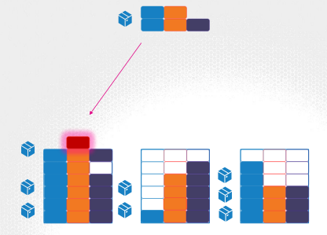

# CKA/CKAD certification documentation

## Configuration


https://kubernetes.io/docs/tutorials/configuration/

### ConfigMap

ConfigMaps are used to pass configuration data in the form of key value pairs in Kubernetes. The configMap stores configuration data in plain text.

https://kubernetes.io/docs/tasks/configure-pod-container/configure-pod-configmap/

```yaml
apiVersion: v1
kind: ConfigMap
metadata:
  name: app-config
data:
  APP_COLOR: blue
  APP_MODE: prod
```

Referencing ConfigMap in a pod

```yaml
apiVersion: v1
kind: Pod
metadata:
  name: simple-webapp-color
  labels:
    name: simple-webapp-color
spec:
  containers:
  - name: simple-webapp-color
    image: simple-webapp-color
    ports:
      - containerPort: 8080
      envFrom:
        - configMapRef:
          name: app-config
```

3 ways to use ConfigMap in a pod

```yaml
envFrom:
  - configMapRef:
    name: app-config
```

```yaml
env:
  - name: APP_COLOR
    valueFrom:
      configMapKeyRef:
        name: app-config
        key: APP_COLOR
```

```yaml
volumes:
- name: app-config-volume
  configMap:
    name: app-config
```

### Secrets

They are similar to configMaps, except that they are stored in an 
encoded or hashed format. As with configMaps, there are two steps involved in working with Secrets. First, create the secret and second inject it into Pod.

https://kubernetes.io/docs/concepts/configuration/secret/

```shell
kubectl create secret generic <secret-name> --from-literal=<key>=<value>
kubectl create secret generic <secret-name> --from-file=<path-to-file>
```

Encode secret
```shell
echo -n "my-secret" | base64
```

```yaml
apiVersion: v1
kind: Secret
metadata:
  name: app-secret
data:
  DB_HOST: xxx
  DB_USER: yyy
  DB_PASS: zzz
```

Decode secret
```shell
echo -n "xxx" | base64 --decode
```

3 ways to use Secret in a pod

https://kubernetes.io/docs/tasks/inject-data-application/distribute-credentials-secure/

```yaml
envFrom:
  - secretRef:
    name: app-secret
```

```yaml
env:
  - name: DB_HOST
    valueFrom:
      secretKeyRef:
        name: app-secret
          key: DB_HOST
```

```yaml
volumes:
- name: app-secret-volume
  configMap:
    name: app-secret
```

### Security Contexts

We have learned that unlike virtual machines containers are not completely isolated from their host. Containers and the hosts share the same kernel. Containers are isolated using namespaces in Linux. The host has a namespace and the containers have their own namespace. All the processes run by the containers are in fact run on the host itself, but in their own namespaces.

https://kubernetes.io/docs/tasks/configure-pod-container/security-context/

```shell
ps aux
docker run --user=<user-id> ubuntu sleep 3600
docker run --cap-add MAC_ADMIN ubuntu
docker run --privileged ubuntu
```

For all the pod

https://kubernetes.io/docs/concepts/policy/pod-security-policy/

```yaml
apiVersion: v1
kind: Pod
metadata:
  name: web-pode
spec:
  securityContext:
    runAsUser: 1000
  containers:
  - name: ubuntu
    image: ubuntu
    command: ["sleep", "3600"]
```

For a specific container in the pod

```yaml
apiVersion: v1
kind: Pod
metadata:
  name: web-pode
spec:
  containers:
  - name: ubuntu
    image: ubuntu
    command: ["sleep", "3600"]

    securityContext:
      runAsUser: 1000
    capabilities:
      add: ["MAC_ADMIN"]
```

https://kubernetes.io/blog/2016/08/security-best-practices-kubernetes-deployment/

### Service Accounts

There are two types of accounts in Kubernetes. **A user account and a service account.**

- user account => human
- service account => machine

https://kubernetes.io/docs/tasks/configure-pod-container/configure-service-account/

When the service account is created, it also creates a token automatically. The service account token is what must be used by the external application while authenticating to the Kubernetes API. The token, however, is stored as a secret object.

1. service account created
2. generate token
3. create a secret object and set token in the secret object
4. Secret object is then linked to the service account

```sh
kubectl exec -it <pod-name> ls /var/run/secrets/kubernetes.io/serviceaccount
kubectl exec -it <pode-name> ls /var/run/secrets/kubernetes.io/serviceaccount/token
```

For every namespace in kubernetes a service account named default is automatically created. Each namespace has its own default service account.

```yaml
apiVersion: v1
kind: Pod
metadata:
  name: my-app
spec:
  containers:
  - name: my-app
    image: my-app
  automountServiceAccountToken: false
```

### Resource Requirements



Resource Requests

```yaml
apiVersion: v1
kind: Pod
metadata:
  name: my-app
spec:
  containers:
  - name: my-app
    image: my-app
  resources:
    requests:
      memory: "1Gi"
      cpu: 1
```

By default, a pod requires 0.5 CPU and 256 Mi.

- 1 G (Gigabyte) = 1 000 000 000 bytes
- 1 M (Megabyte) = 1 000 000 bytes
- 1 K (Kilobytes) = 1 000 bytes

- 1 Gi (Gibibyte) = 1 073 741 824 bytes
- 1 Mi (Mebibyte) = 1 048 576 bytes
- 1 Ki (Kibibyte) = 1 024 bytes

Resource Limits

```yaml
apiVersion: v1
kind: Pod
metadata:
  name: my-app
spec:
  containers:
  - name: my-app
    image: my-app
  resources:
    requests:
      memory: "1Gi"
      cpu: 1
    limits:
      memory: "2Gi"
      cpu: 2
```

> A container cannot use more CPU resources than its limit.  However, this is not the case with memory. A container CAN use more memory resources that its limit.