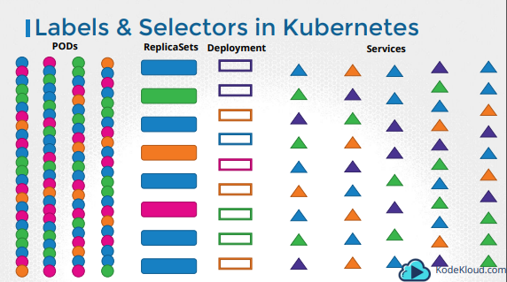
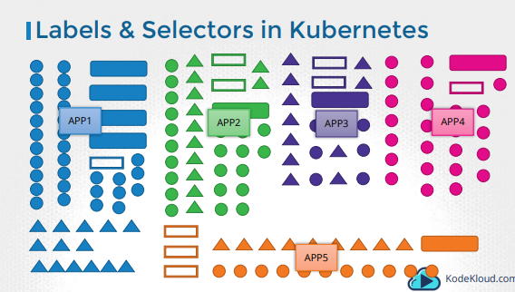
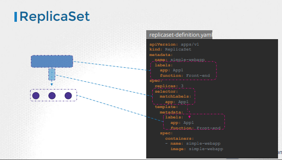
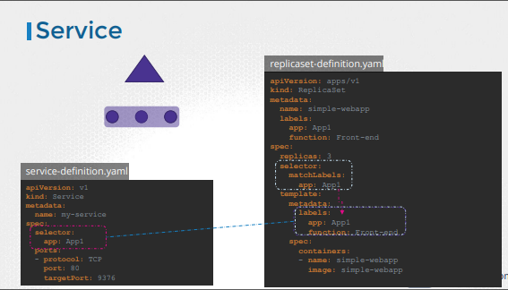
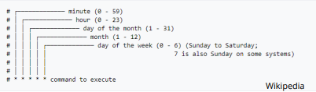

# CKA/CKAD certification documentation

## Pod Design

### Labels, Selectors & Annotations

#### Labels

> Labels and Selectors are a standard method to group and find things together.




```yaml
apiVersion: v1
kind: Pod
metadata:
  name: simple-webapp
  labels:
    tier: frontend
    env: prod
spec:
  containers:
  - name: simple-webapp
    image: simple-webapp
    ports:
      - containerPort: 8080
```

#### Selectors

```sh
kubectl get pods --selector tier=frontend
```

Before



After



#### Annotations

While labels and selectors are used to group and select objects, annotations are used to record other details for informatory purpose. 

```yaml
apiVersion: v1
kind: Pod
metadata:
  name: simple-webapp
  labels:
    tier: frontend
    env: prod
  annotations:
    buildVersion: 1.3.4
spec:
  containers:
  - name: simple-webapp
    image: simple-webapp
    ports:
      - containerPort: 8080
```

### Rollings updates & rollbacks

When you upgrade your instances, you do not want to upgrade all of them at once as we just did. This may impact users accessing our applications, so you may want to upgrade them one after the other. And that kind of upgrade is known as Rolling Updates.

Deployment which is a kubernetes object that comes higher in the hierarchy. The deployment provides us with capabilities to upgrade the underlying instances seamlessly using rolling updates, undo changes, and pause and resume changes to deployments.

```yaml
apiVersion: apps/v1
kind: Deployment
metadata:
  name: myapp-deployment
  labels:
    app: myapp
    type: frontend
spec:
  replicas: 3
  selector:
    matchLabels:
      type: frontend
  template:
    metadata:
      name: myapp-pod
      labels:
        app: myapp
        type: frontend
    spec:
      containers:
        - name: nginx
          image: nginx
```

A rollout is the process of gradually deploying or upgrading your application containers. Whenever you create a new deployment or upgrade the images in an existing deployment it triggers a Rollout.

```sh
kubectl rollout status deployment/myapp-deployment
kubectl rollout history deployment/myapp-deployment
kubectl rollout undo deployment/myapp/deployment
```

- Recreate strategy
- Rolling update strategy (default one !)

### Jobs and CronJobs

There are other kinds of workloads such as batch processing, analytics or reporting that are meant to carry out a specific task and then finish.

```yaml
apiVersion: batch/v1
kind: Job
metadata:
  name: math-add-job
spec:
  completions: 3 # how many pods for this job
  parallelism: 3 # run 3 pods in parallel, by default it's sequentially
  template:
    spec:
      containers:
      - name: math-add
        image: ubuntu
        command: ["expr","3","+","2"]
      restartPolicy: Never

```

### CronJobs

A cronjob is a job that can be scheduled.



```yaml
apiVersion: batch/v1beta1
kind: CronJob
metadata:
  name: reporting-job
spec:
  schedule: "*/1 * * * *"
  jobTemplate:
    spec:
      completions: 3
      parallelism: 3
      template:
        spec:
          containers:
          - name: reporting-tool
            image: reporting-tool
          restartPolicy: Never

```