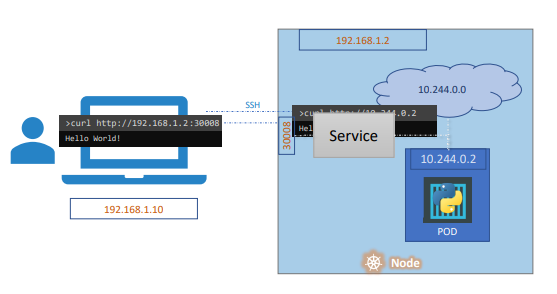
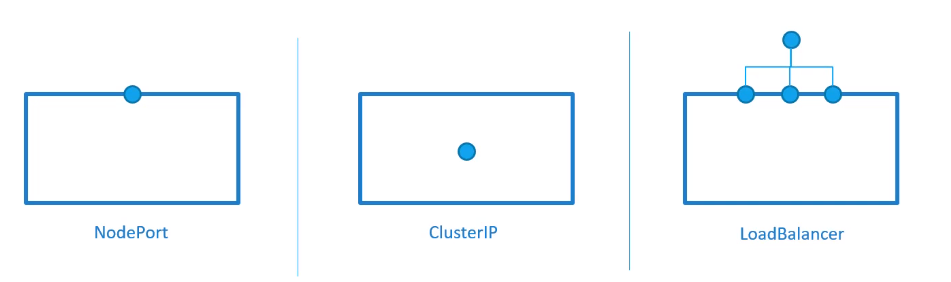
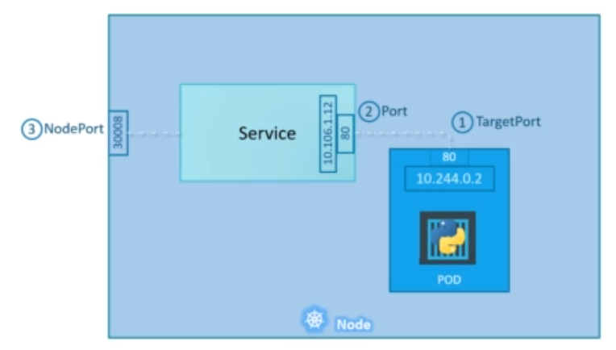
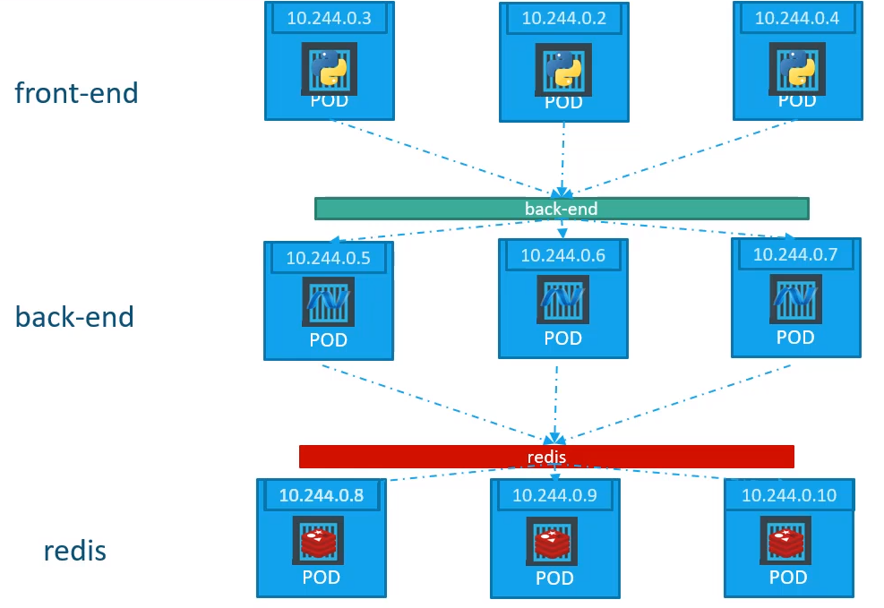
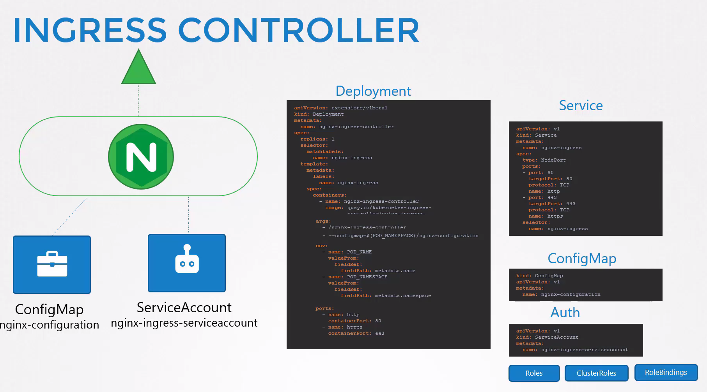

# CKA/CKAD certification documentation

## Services & Networking

### Services

Services enables communications between various components within and outside the application. Services helps us connect applications together with other applications or users.



- NodePort
  - The service makes an internal port accessible on a poryt of the node
- ClusterIP
  - The service creates a virtual IP inside the cluster to enable communication between different applications
- LoadBalancer
  - Provision a LoadBalancer for our application in supported cloud providers

  

#### NodePort

Expose to the outside of a cluster.

A NodePort service spans across all nodes of the cluseter.



```yaml
apiVersion: v1
kind: Service
metadata:
  name: myapp-service
spec:
  type: NodePort
  ports:
  - targetPort: 80
    port: 80
    nodePort: 30008
  selector:
    app: myapp
    type: frontend
```

#### ClusterIP

Expose to the inside of a cluster.



```yaml
apiVersion: v1
kind: Service
metadata:
  name: backend-service
spec:
  type: ClusterIP #default type
  ports:
  - targetPort: 80
    port: 80
  selector:
    app: myapp
    type: backend
```

### Ingress

Ingress helps your users access your application using a single Externally accessible URL, that you can configure to route to different services within your cluster based on the URL path, at the same time terminate TLS.

Simply put, think of ingress as a layer 7 load balancer built-in to the kubernetes cluster that can be configured using native kubernetes primitives just like any other object in kubernetes.

**K8S does not come with a ingress by default**. GCE and NGINX are currently being supported and maintained by the Kubernetes project.

https://kubernetes.github.io/ingress-nginx/user-guide/nginx-configuration/
https://kubernetes.github.io/ingress-nginx/deploy/


#### Ingress Controller 

- nginx
- haproxy
- traefik
- contour



#### Ingress Resources

```yaml
apiVersion: extensions/v1beta1
kind: Ingress
metadata:
  name: ingress-wear
spec:
  rules:
  - host: wear.myonlinestore.com
    http:
      paths:
      - path: /wear
        backend:
          serviceName: wear-service
          servicePort: 80
```

```yaml
apiVersion: networking.k8s.io/v1
kind: Ingress
metadata:
  name: ingress-wear
spec:
  rules:
  - host: wear.myonlinestore.com
    http:
      paths:
      - path: /wear
        pathType: Prefix
        backend:
          service:
            name: wear-service
            port:
              number: 80
```

```sh
kubectl create ingress <ingress-name> -- rule="host/path=service:port"
```

### Network Policies

For example, for a web server, the incoming traffic from the users is an Ingress Traffic. And the outgoing requests to the app server is Egress traffic.


So we have a cluster with a set of nodes hosting a set of pods and services. Each node has an IP address and so does each pod as well as service.

One of the pre-requisite for networking in kubernetes, is whatever solution you implement, **the pods should be able to communicate with each other without having to configure any additional settings, like routes**. Kubernetes is configured by default with an “All Allow” rule that allows traffic from any pod to any other pod or services.


A Network policy is another object in the kubernetes namespace. Just like PODs, ReplicaSets or Services. You link a network policy to one or more pods. You can 
define rules within the network policy.

```yaml
apiVersion: networking.k8s.io/v1
kind: NetworkPolicy
metadata:
  name: test-network-policy
  namespace: default
spec:
  podSelector:
    matchLabels:
      role: db
  policyTypes:
    - Ingress
    - Egress
  ingress:
    - from:
        - ipBlock:
            cidr: 172.17.0.0/16
            except:
              - 172.17.1.0/24
        - namespaceSelector:
            matchLabels:
              project: myproject
        - podSelector:
            matchLabels:
              role: frontend
      ports:
        - protocol: TCP
          port: 6379
  egress:
    - to:
        - ipBlock:
            cidr: 10.0.0.0/24
      ports:
        - protocol: TCP
          port: 5978
```

> **Warning: ** Flannel CNI does not support network policy