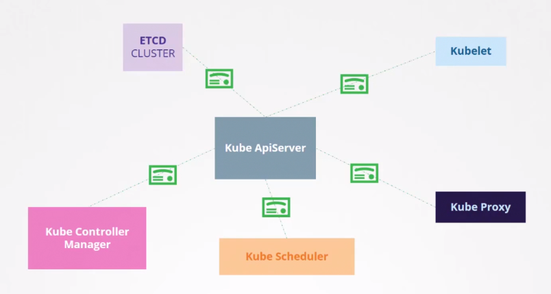

# CKA/CKAD certification documentation

## Kubernetes security primitives

Control access to the kube apiserver :

- who can access ?
    - password based
    - ssh key
    - certificate
    - external auth
    - service account
- what can they do ?
    - RBAC
    - ABAC
    - Node authorization
    - Webhook Mode

## Authentication

- admins
- developers
- machine to machine
